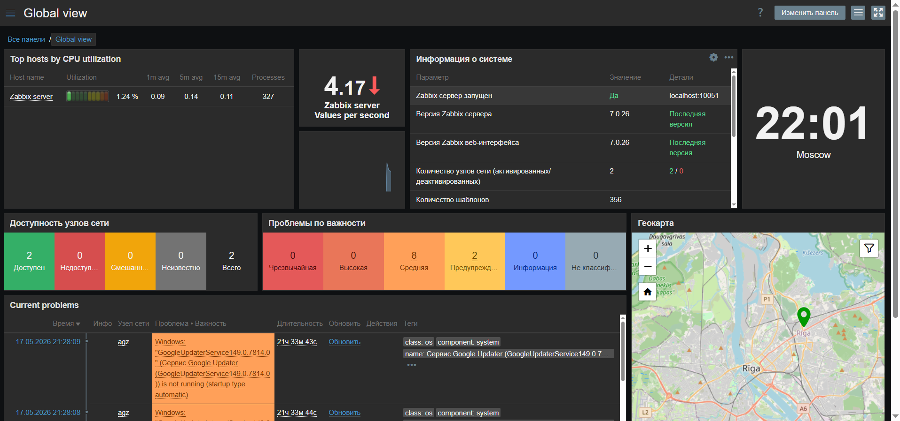
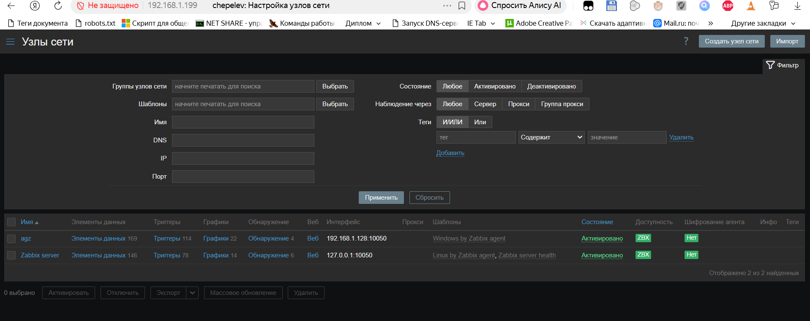
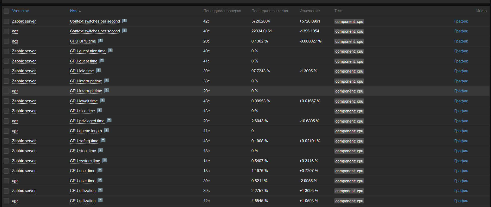
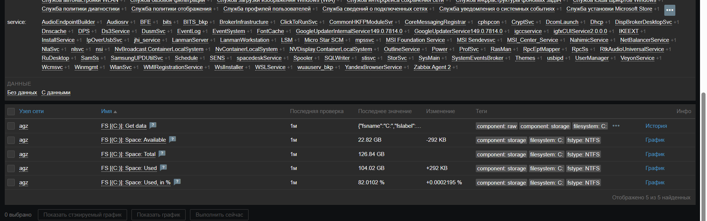

# Домашнее задание к занятию «Система мониторинга Zabbix»(Чепелев Павел)


### Задание 1 

Установите Zabbix Server с веб-интерфейсом.

#### Процесс выполнения
1. Выполняя ДЗ, сверяйтесь с процессом отражённым в записи лекции.
2. Установите PostgreSQL. Для установки достаточна та версия, что есть в системном репозитороии Debian 11.
3. Пользуясь конфигуратором команд с официального сайта, составьте набор команд для установки последней версии Zabbix с поддержкой PostgreSQL и Apache.
4. Выполните все необходимые команды для установки Zabbix Server и Zabbix Web Server.

#### Требования к результатам 
1. Прикрепите в файл README.md скриншот авторизации в админке.

2. Приложите в файл README.md текст использованных команд в GitHub.
``` bash
 wget https://repo.zabbix.com/zabbix/7.0/debian/pool/main/z/zabbix-release/zabbix-release_latest_7.0+debian13_all.deb
 dpkg -i zabbix-release_latest_7.0+debian13_all.deb
 apt update
 apt install zabbix-server-pgsql zabbix-frontend-php php8.4-pgsql zabbix-apache-conf zabbix-sql-scripts zabbix-agent
 sudo -u postgres createuser --pwprompt zabbix
 sudo -u postgres createdb -O zabbix zabbix
 zcat /usr/share/zabbix-sql-scripts/postgresql/server.sql.gz | sudo -u zabbix psql zabbix
 DBPassword=password
 systemctl restart zabbix-server zabbix-agent apache2
 systemctl enable zabbix-server zabbix-agent apache2
```
---

### Задание 2 

Установите Zabbix Agent на два хоста.

#### Процесс выполнения
1. Выполняя ДЗ, сверяйтесь с процессом отражённым в записи лекции.
2. Установите Zabbix Agent на 2 вирт.машины, одной из них может быть ваш Zabbix Server.
3. Добавьте Zabbix Server в список разрешенных серверов ваших Zabbix Agentов.
4. Добавьте Zabbix Agentов в раздел Configuration > Hosts вашего Zabbix Servera.
5. Проверьте, что в разделе Latest Data начали появляться данные с добавленных агентов.

#### Требования к результатам
1. Приложите в файл README.md скриншот раздела Configuration > Hosts, где видно, что агенты подключены к серверу


2. Приложите в файл README.md скриншот лога zabbix agent, где видно, что он работает с сервером
``` bash
agz@debian:~/Desktop/zabbix$ sudo cat /var/log/zabbix/zabbix_agentd.log 
  1077:20260517:232832.816 Got signal [signal:15(SIGTERM),sender_pid:4653,sender_uid:116,reason:0]. Exiting ...
  1077:20260517:232832.818 Zabbix Agent stopped. Zabbix 7.0.26 (revision 3832e2a0553).
  5218:20260517:233148.762 Starting Zabbix Agent [Zabbix server]. Zabbix 7.0.26 (revision 3832e2a0553).
  5218:20260517:233148.762 **** Enabled features ****
  5218:20260517:233148.762 IPv6 support:          YES
  5218:20260517:233148.762 TLS support:           YES
  5218:20260517:233148.762 **************************
  5218:20260517:233148.762 using configuration file: /etc/zabbix/zabbix_agentd.conf
  5218:20260517:233148.763 agent #0 started [main process]
  5219:20260517:233148.763 agent #1 started [collector]
  5220:20260517:233148.764 agent #2 started [listener #1]
  5221:20260517:233148.764 agent #3 started [listener #2]
  5222:20260517:233148.764 agent #4 started [listener #3]
  5223:20260517:233148.764 agent #5 started [active checks #1]
  5218:20260517:233225.800 Got signal [signal:15(SIGTERM),sender_pid:5403,sender_uid:116,reason:0]. Exiting ...
  5218:20260517:233225.801 Zabbix Agent stopped. Zabbix 7.0.26 (revision 3832e2a0553).
  5407:20260517:233225.815 Starting Zabbix Agent [Zabbix server]. Zabbix 7.0.26 (revision 3832e2a0553).
  5407:20260517:233225.815 **** Enabled features ****
  5407:20260517:233225.815 IPv6 support:          YES
  5407:20260517:233225.815 TLS support:           YES
  5407:20260517:233225.815 **************************
  5407:20260517:233225.815 using configuration file: /etc/zabbix/zabbix_agentd.conf
  5407:20260517:233225.816 agent #0 started [main process]
  5408:20260517:233225.816 agent #1 started [collector]
  5409:20260517:233225.816 agent #2 started [listener #1]
  5410:20260517:233225.817 agent #3 started [listener #2]
  5411:20260517:233225.817 agent #4 started [listener #3]
  5412:20260517:233225.817 agent #5 started [active checks #1]
  ```
3. Приложите в файл README.md скриншот раздела Monitoring > Latest data для обоих хостов, где видны поступающие от агентов данные.


4. Приложите в файл README.md текст использованных команд в GitHub
Установка и настройка агента производилась своместно с установкой сервера zabbix, что видно из 2 пункта 1го задания
---
## Задание 3 со звёздочкой*
Установите Zabbix Agent на Windows (компьютер) и подключите его к серверу Zabbix.

#### Требования к результатам
1. Приложите в файл README.md скриншот раздела Latest Data, где видно свободное место на диске C:

--- 

## Критерии оценки

1. Выполнено минимум 2 обязательных задания
2. Прикреплены требуемые скриншоты и тексты 
3. Задание оформлено в шаблоне с решением и опубликовано на GitHub